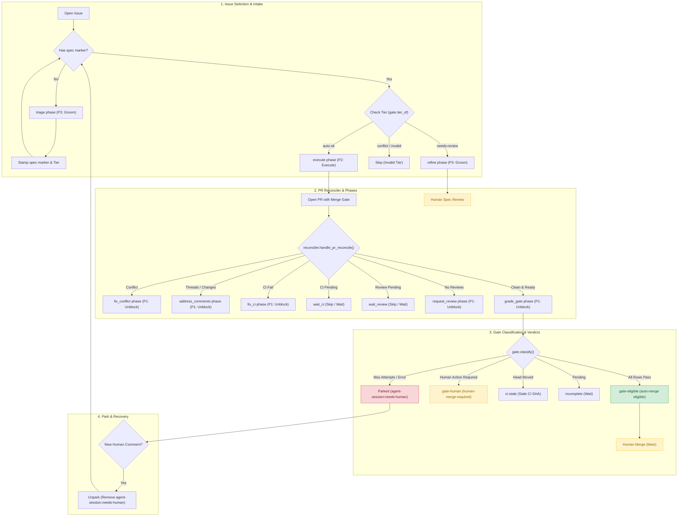

# agent-sessions

An autonomy harness and skill component for handing more of a software project's routine work to an AI coding agent — and,
just as importantly, for knowing which work you shouldn't hand over.

**New here?** [docs/orientation.md](docs/orientation.md) is the full introduction, including a
glossary of the terms the rest of the docs assume. This page is the short version.

## The problem

Burning down a project board by hand looks like this, over and over: pick an issue, write a
spec, plan it, do the work, run the tests, open a PR, address review comments, merge.

Most of those steps are tedious rather than difficult. An agent can do them. But turning an
agent loose on a backlog goes wrong in a specific way — not usually by writing bad code, but
by **deciding it succeeded when it didn't**. It writes a test that passes for the wrong
reason, or grades its own homework, or quietly reinterprets what "done" meant.

So the question this repo is built around isn't *"can an agent do the work?"* It's
**"how do we know whether it did?"**

## The one idea everything follows from

> **An agent is only as autonomous as its verifier is trustworthy.**

If a task's definition of done can be checked by something that can't be argued with — a
test, a lint rule, a command with a specific expected output — then an agent can attempt it
unattended, because success isn't a matter of opinion.

If the only honest check is *"a human looks at it and decides,"* then a human belongs there.
That isn't a failure; it's useful information about the task.

The payoff is that **this becomes a property of the issue, not of the agent.** You can sort a
backlog into "safe to attempt unattended" and "needs a person" *before* any work starts — and
that sorting falls out of a question you should be asking anyway: *how would we actually know
this was done?*

Two things follow, and they're the parts most easily gotten wrong:

- **The check has to exist before the work starts, and be frozen.** An agent that can edit its
  own acceptance criteria mid-task has no acceptance criteria.
- **Whoever grades the work can't be whoever did it.** Here the grader is a separate agent with
  no ability to write files, so it *structurally* cannot fix what it's grading.

## What's in this repo

A harness that drives an unattended loop, and a skill component that supplies the content for each phase:

**The harness** (`src/agent_sessions/` + `Makefile`) — the system's autonomy infrastructure. It owns the phase state machine, priority ladder, distributed mutual exclusion, budget accounting, pluggable agent backends, and run provenance. On the merge gate it owns the *routing*: the skill writes the verdict into the PR body and the harness reads it (`gate.py`) rather than re-deriving it. `driver/` holds only a compatibility launcher.

**The `agent-session` skill component** (`skills/agent-session/`) — the instructions that govern what happens *inside* each phase.

Keeping them separate is deliberate: the skill component is graded by whether its wording changes agent behaviour (via cheap classifier evals or micro-tests), while the harness is graded by whether its fixture and mutation tests pass. Different questions, different evidence.

## How the skill works

You name the mode you want; it reads only that mode's instructions, so adding a mode costs no
context in the others. The dispatcher table in
[skills/agent-session/SKILL.md](skills/agent-session/SKILL.md) is the list.

**Getting an issue ready** — the human-in-the-loop half:

| Mode | What it does |
|---|---|
| `intake` | Interviews you about one request or issue, turns it into acceptance criteria that each name a runnable check, and files or updates the issue |
| `triage` | The batch version: scans a backlog, proposes criteria for the under-specified issues, you ratify in a fast pass |

**Doing the work** — the autonomous half:

| Mode | What it does |
|---|---|
| `plan` | **Freezes the checks first**, then plans the work against current code |
| `execute` | Does the work; the frozen checks are the gate, graded by an agent that didn't write the code |
| `pr` | Self-review, PR, review cycle, then stops at the merge gate and reports |
| `express` | All three above, end to end, unattended |

Two mechanisms tie it together:

**A marker.** Issues that have been through `intake` or `triage` carry a hidden
`<!-- agent-session:spec -->` comment. The working modes refuse to run without it — so an
under-specified issue can't be attempted by accident.

**A tier**, written into the issue body and derived rather than chosen. If every criterion
resolves to a runnable check and the work touches nothing risky, it's `auto-ok`. If any
criterion comes down to human judgement, *or* the work touches authentication, secrets, data
migration, CI config, or dependencies, it's `needs-review` — however good the tests are.

The tier controls **where the run surfaces to a human**, not whether it runs. A `needs-review`
issue still gets worked end to end; it just can't clear the merge gate on its own.

## Issue & PR state flow

The system's selection, PR reconciliation, gate classification, and park/unpark transitions flow through this state machine:

<!-- BEGIN ISSUE_PR_STATE_DIAGRAM -->



<!-- END ISSUE_PR_STATE_DIAGRAM -->

## Using it

Run a mode against an issue. **The skill is not installed as a registered skill**, in this or
any harness — deliberately, so it is exercised as the files in this repo rather than as a
copy. You point a session at a phase file and follow it. `docs/orientation.md` has the
walkthrough.

Run the driver over a board:

```bash
make dry-run     # what would be picked, and why everything else was skipped
make run         # one issue, unattended
make loop        # a deeper queue; ISSUES=n to set it
```

And the gate the project holds itself to:

```bash
make check       # every check, in one go: tests, lint, typecheck, doc rot, and the rest
make help        # what else there is
```

**Nothing merges by machine.** The strongest verdict the gate can reach is
`eligible-for-auto-merge`, which is a *finding it reports*, not an action it takes. A human
still clicks merge. Every PR this system has produced was merged by hand.

**The system runs under its own GitHub account, not yours.** Two tokens on a machine user: the
agent gets a read-only one and cannot write to GitHub at all; it records the writes it wants —
comments, labels, the branch push, the PR — and the driver validates that record and performs them
with the write token. There is no entry in that vocabulary that merges, so "nothing merges by
machine" is a property of what the agent can express rather than an instruction it is following.

There is no fallback to your `gh` login. Both tokens are checked against a live `gh api user`
before anything is spent, and the driver refuses to start if either belongs to somebody else. See
[`.env.example`](.env.example).

See [docs/usage.md](docs/usage.md) for the operator's guide — what the outcomes mean, what
files a run leaves behind, and how to recover an interrupted one.

## Status

The skill is complete and has real-run evidence on its routing paths. Every PR it has produced
has been merged by a human, by hand — nothing has ever merged by machine, which is a property of
the design rather than a stage of it. The driver runs unattended over a queue, against more than
one repository. This project tracks its own backlog on [its own
board](https://github.com/users/lmorchard/projects/9), using its own tooling.

For how much has actually run — how many runs, on which repositories, through which phases, and
how they came out — run `make evidence`. It reads the per-run ledgers, and it is deliberately
the only answer given here: a number written into this paragraph would be wrong within a week.

Conditional auto-merge is not pursued. The objective is to maximize the attention ratio: preparing everything up to the merge gate perfectly, ensuring the human is only ever interrupted for judgment rather than mechanical failures.

## Reading further

Ordered by how likely you are to want it:

- **[docs/orientation.md](docs/orientation.md)** — the newcomer's introduction: the vocabulary,
  what's in the repo, how one issue flows through it, and what is and isn't proven yet.
- **[docs/usage.md](docs/usage.md)** — operator's guide: commands, outcomes, artifacts, recovery.
- **[docs/design.md](docs/design.md)** — what the system is and why it has this shape, with the
  reasoning trail preserved.
- **[docs/findings.md](docs/findings.md)** — the durable lessons: recurring defect classes, what
  was measured and what it showed, and a list of verified gotchas. **Read the gotchas before
  writing any command-line flag or gate condition** — several are the opposite of what they
  look like.
- **[docs/prior-art.md](docs/prior-art.md)** — survey of related work, with claims marked
  verified or not.
- **[docs/archive/build-log.md](docs/archive/build-log.md)** — the chronological account of the first
  five moves, now closed. Useful for the *incidents behind the rules* in `findings.md`; its
  state claims have decayed and it says so.
- **[CLAUDE.md](CLAUDE.md)** — conventions for working in this repo, and which paths are
  off-limits to unattended runs.

Lineage: this is a sequel to a personal `dev-session` skill, which structures *building one
thing*. `agent-session` front-loads what an autonomous loop needs so the middle can run
unattended.
